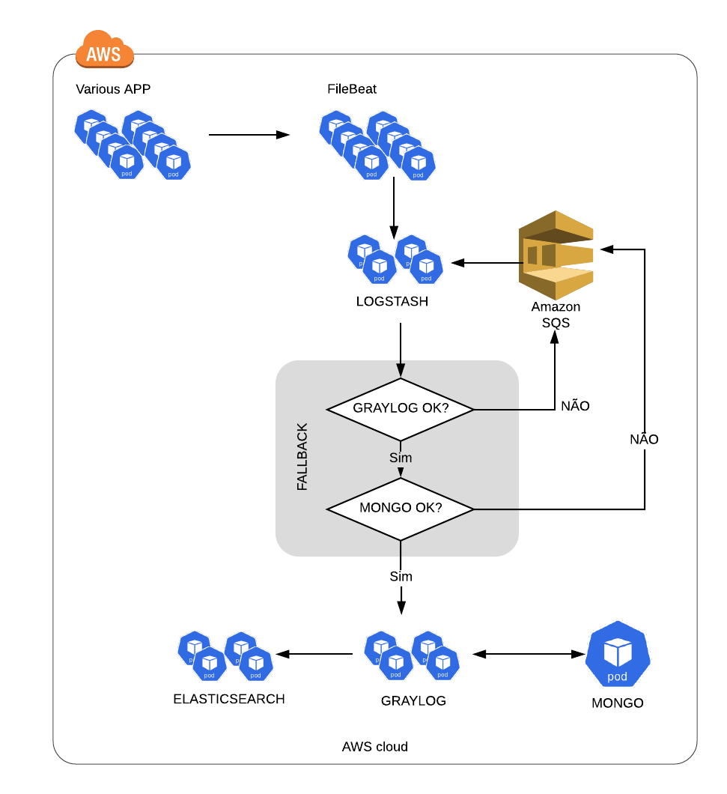

# platfom-logs-ls-fallback Documentation

This is the repository of our [Logstash](https://www.elastic.co/products/logstash) app that ships all GrupoZap logs to [Graylog](https://github.com/grupozap/platform-logs-mongo).

Application Logstash-fallback

## Purpose

This Documentation 

## Architecture

## Application Checklist

- [x] Logs to `stdout`
